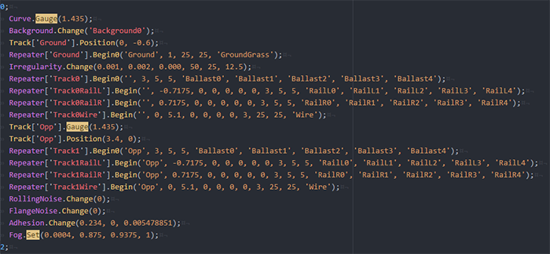

# **language-bve5**
####   BVE5.7用構文パッケージ

## これは何？

テキストエディタ'Atom'でBVE5のシンタックスハイライト(色分け)、スニペットの挿入を行うパッケージです。BVE5の下記ファイル構文に対応していますが、正しくハイライトされない場合があるかもしれません。スニペットの挿入はごく一部の構文(Repeater.Beginなど)のみ対応しています。

使用するためにはBVEのヘッダを入力したファイルを保存/読み込みする、もしくはAtomの文法を適切な言語に変更する必要があります。

## シンタックスハイライト対応ファイル一覧

以下のファイル形式に対応しています。（括弧内は各ファイルのヘッダ）

- マップ(BveTs Map 2.02)
- ストラクチャーリスト(BveTs Structure List 2.00)
- サウンドリスト(BveTs  Sound List 2.00)
- 停車場リスト(BveTs Station List 2.00)
- 他列車(BveTs Train 1.01)

## サポート

バグの報告や要望はこちらへ。
<http://aoisupersix.wpblog.jp/>
